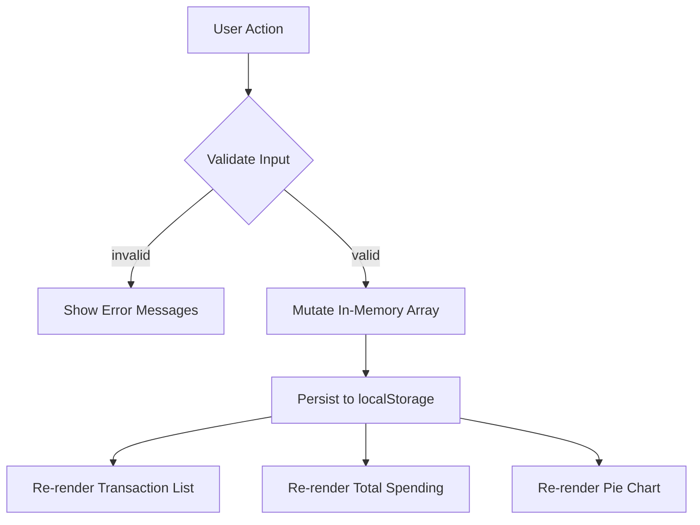

# Design Document: Expense & Budget Visualizer

## Overview

The Expense & Budget Visualizer is a single-page web application built with plain HTML, CSS, and JavaScript (no frameworks, no build tools). Users can record spending transactions, view them in a list, track total spending, and see a per-category pie chart powered by Chart.js.

The entire application lives in three files:

| File | Role |
|---|---|
| `index.html` | Page structure, CDN script tag for Chart.js |
| `css/style.css` | All visual styling |
| `js/script.js` | All application logic, organised by comment section headers |

All data is persisted to the browser's `localStorage` under the key `"transactions"`. There is no backend.

---

## Architecture

The app follows a simple logic-first, render-after pattern:

1. User action → captured by a DOM event listener
2. Validation / data mutation → pure JS functions transform the in-memory `transactions` array
3. Persist → the updated array is serialised to JSON and written to `localStorage`
4. Render → DOM-manipulation functions rebuild the transaction list, total, and chart from the in-memory array

There is no reactive framework; every render is an explicit function call triggered after a state change.



### Section layout inside js/script.js

```
// === STORAGE ===       saveTransactions(), loadTransactions()
// === DATA / LOGIC ===  validateInput(), addTransaction(), deleteTransaction(),
//                       calculateTotal(), aggregateByCategory(), formatAmount()
// === CHARTS ===        renderChart()
// === UI / DOM ===      renderList(), renderTotal(), renderEmptyState(),
//                       showErrors(), clearErrors(), resetForm()
// === INIT ===          DOMContentLoaded handler
```

---

## Components and Interfaces

### Storage module (// === STORAGE ===)

**saveTransactions(transactions): void**
- Serialises the array to JSON and calls `localStorage.setItem("transactions", json)`.
- Throws (or is caught by the caller) if `localStorage.setItem` throws a DOMException.

**loadTransactions(): Transaction[]**
- Reads `localStorage.getItem("transactions")`.
- Returns the parsed array on success.
- Returns `[]` if the key is missing or the JSON is invalid.

---

### Data / Logic module (// === DATA / LOGIC ===)

**validateInput(name, amount, category): ValidationResult**
- Checks all three fields simultaneously (not early-exit).
- Returns `{ valid: boolean, errors: { name?, amount?, category? } }`.
- Name rule: trimmed length must be > 0.
- Amount rule: parsed float must satisfy `0.01 ≤ value ≤ 999,999,999.99`.
- Category rule: value must be one of `"Food"`, `"Transport"`, `"Fun"`.

**addTransaction(transactions, entry): Transaction[]**
- Returns a new array with the new Transaction appended at the end.
- Does not mutate the original array.
- Assigns a unique id using `Date.now().toString()`.

**deleteTransaction(transactions, id): Transaction[]**
- Returns a new array with the matching transaction removed.
- Does not mutate the original array.

**calculateTotal(transactions): number**
- Returns the sum of all amount values, or `0` for an empty array.

**aggregateByCategory(transactions): CategoryTotals**
- Returns `{ Food: number, Transport: number, Fun: number }`.
- Categories with no transactions have value `0` and are excluded from chart data.

**formatAmount(amount): string**
- Returns the amount formatted to exactly 2 decimal places.

---

### Charts module (// === CHARTS ===)

**renderChart(categoryTotals): void**
- Uses `window.Chart` loaded from the CDN.
- On first call: creates a new `Chart` instance on `<canvas id="expense-chart">`.
- On subsequent calls: updates `chart.data.labels` and `chart.data.datasets[0].data`, then calls `chart.update()`.
- Filters out categories where `value === 0` before building labels/data arrays.
- Hides the `<canvas>` and shows a placeholder `<p>` when all totals are 0; reverses when totals exist.

---

### UI / DOM module (// === UI / DOM ===)

**renderList(transactions): void**
- Clears `<ul id="transaction-list">` and rebuilds it from the array.
- Each `<li>` contains: name, formatted amount, category badge, and a delete `<button data-id="...">`.
- If the array is empty, calls `renderEmptyState()` instead.

**renderTotal(total): void**
- Sets `document.getElementById("total-spending").textContent` to `formatAmount(total)`.

**showErrors(errors): void**
- For each field with an error: makes the relevant `<span class="error-msg">` visible and sets its text.

**clearErrors(): void**
- Hides all `<span class="error-msg">` elements.

**clearFieldError(field): void**
- Hides the error message for a single field. Called `oninput`/`onchange` per field.

**resetForm(): void**
- Resets the `<form id="transaction-form">` using `form.reset()`.

---

### Init module (// === INIT ===)

The `DOMContentLoaded` listener:
1. Loads transactions from localStorage via `loadTransactions()`.
2. Calls `renderList()`, `renderTotal()`, and `renderChart()` with the loaded data.
3. Attaches the `submit` event listener to `<form id="transaction-form">`.
4. Attaches a `click` event listener on `<ul id="transaction-list">` (event delegation) for delete buttons.
5. Attaches `input`/`change` listeners per field to clear individual field errors on correction.

---

## Data Models

### Transaction

```js
/**
 * @typedef {Object} Transaction
 * @property {string} id       - Unique identifier (Date.now().toString())
 * @property {string} name     - User-supplied description (non-empty, trimmed)
 * @property {number} amount   - Positive float, 0.01–999999999.99
 * @property {string} category - One of: "Food" | "Transport" | "Fun"
 */
```

### ValidationResult

```js
/**
 * @typedef {Object} ValidationResult
 * @property {boolean} valid
 * @property {{ name?: string, amount?: string, category?: string }} errors
 */
```

### CategoryTotals

```js
/**
 * @typedef {Object} CategoryTotals
 * @property {number} Food
 * @property {number} Transport
 * @property {number} Fun
 */
```

### localStorage schema

Key: `"transactions"`
Value: JSON array of `Transaction` objects.

```json
[
  { "id": "1700000000000", "name": "Lunch", "amount": 12.50, "category": "Food" },
  { "id": "1700000001000", "name": "Bus fare", "amount": 2.00, "category": "Transport" }
]
```

---

## HTML Structure (index.html)

```html
<body>
  <header><h1>Expense & Budget Visualizer</h1></header>
  <main>
    <section id="form-section">
      <form id="transaction-form">
        <div class="field-group">
          <label for="name-input">Name</label>
          <input id="name-input" type="text" />
          <span class="error-msg" id="name-error" hidden></span>
        </div>
        <div class="field-group">
          <label for="amount-input">Amount</label>
          <input id="amount-input" type="number" step="0.01" />
          <span class="error-msg" id="amount-error" hidden></span>
        </div>
        <div class="field-group">
          <label for="category-select">Category</label>
          <select id="category-select">
            <option value="">-- Select --</option>
            <option value="Food">Food</option>
            <option value="Transport">Transport</option>
            <option value="Fun">Fun</option>
          </select>
          <span class="error-msg" id="category-error" hidden></span>
        </div>
        <button type="submit">Add Transaction</button>
      </form>
    </section>
    <section id="summary-section">
      <p>Total Spending: <strong id="total-spending">0.00</strong></p>
    </section>
    <section id="list-section">
      <h2>Transactions</h2>
      <ul id="transaction-list"></ul>
      <p id="empty-message">No transactions yet.</p>
    </section>
    <section id="chart-section">
      <h2>Spending by Category</h2>
      <canvas id="expense-chart"></canvas>
      <p id="chart-placeholder">Add transactions to see the chart.</p>
    </section>
  </main>
  <script src="https://cdn.jsdelivr.net/npm/chart.js"></script>
  <script src="js/script.js"></script>
</body>
```

---

## Error Handling

| Scenario | Detection | Response |
|---|---|---|
| Empty or whitespace name | `validateInput` returns `errors.name` | Show error message; do not save |
| Amount out of range or non-numeric | `validateInput` returns `errors.amount` | Show error message; do not save |
| No category selected | `validateInput` returns `errors.category` | Show error message; do not save |
| Multiple invalid fields | All errors collected before return | Show all error messages simultaneously; preserve valid field values |
| `localStorage.setItem` throws on delete | `try/catch` in delete handler | Show an error message; leave Transaction List unchanged |
| `localStorage.setItem` throws on add | `try/catch` in add handler | Show an error message; do not add the transaction |
| `localStorage.getItem` returns invalid JSON | `try/catch` around `JSON.parse` in `loadTransactions` | Return `[]`; display 0.00 total; no error message shown |
| `localStorage.getItem` returns `null` | Null-check in `loadTransactions` | Return `[]`; silent fallback |
| Chart.js not loaded (CDN failure) | Guard: `if (window.Chart)` in `renderChart` | Skip chart render; placeholder remains visible |

---

## Testing Strategy

Open `index.html` directly in a browser (no server needed). Work through each checklist item in order. Use the browser's DevTools → Application → Local Storage panel to inspect stored data, and the Console tab to spot any JS errors.

### 1. Initial page load (empty state)

- [ ] The page loads without any console errors.
- [ ] The transaction list shows the "No transactions yet." message.
- [ ] Total Spending displays **0.00**.
- [ ] The pie chart canvas is hidden and the "Add transactions to see the chart." placeholder is visible.

---

### 2. Form validation

- [ ] Click **Add Transaction** with all fields empty → three error messages appear simultaneously (name required, valid amount required, category required).
- [ ] Fill in only the name, then submit → amount and category errors appear; name error is gone.
- [ ] Enter a name, then type a letter in the amount field (or 0, or a negative number), then submit → amount error appears.
- [ ] Enter a name and a valid amount but leave category on "-- Select --", then submit → only the category error appears.
- [ ] After triggering the name error, start typing in the name field → the name error disappears immediately without submitting.
- [ ] After triggering the amount error, change the amount field → the amount error disappears immediately.
- [ ] After triggering the category error, pick a category → the category error disappears immediately.

---

### 3. Adding transactions

- [ ] Fill in a valid name ("Lunch"), amount (12.50), and category (Food). Click **Add Transaction**.
  - The form clears.
  - "Lunch" appears in the transaction list with the amount shown as **12.50** and the Food badge.
  - Total Spending updates to **12.50**.
  - The pie chart appears with a single Food slice; the placeholder is hidden.
- [ ] Add a second transaction: "Bus" / 3.00 / Transport.
  - Total Spending updates to **15.50**.
  - The pie chart now shows two slices (Food and Transport).
- [ ] Add a third transaction: "Cinema" / 20.00 / Fun.
  - All three category slices are visible in the pie chart.
  - Total Spending is **35.50**.
- [ ] Verify the transactions appear in the order they were added (Lunch, Bus, Cinema).

---

### 4. Deleting transactions

- [ ] Click the delete button next to "Bus".
  - "Bus" is removed from the list within 500 ms.
  - Total Spending updates to **32.50**.
  - The Transport slice disappears from the pie chart.
- [ ] Delete all remaining transactions one by one.
  - After the last deletion the list shows "No transactions yet."
  - Total Spending shows **0.00**.
  - The pie chart canvas is hidden and the placeholder reappears.

---

### 5. Amount formatting

- [ ] Add a transaction with amount **5** (no decimals) → displayed in the list as **5.00**.
- [ ] Add a transaction with amount **9.9** (one decimal) → displayed as **9.90**.
- [ ] Verify the Total Spending label also always shows exactly two decimal places.

---

### 6. localStorage persistence

- [ ] Add two or three transactions, then close the tab and reopen `index.html` (or press F5).
  - All transactions reappear in the same order.
  - Total Spending and the pie chart are correct.
- [ ] Open DevTools → Application → Local Storage → select the file origin.
  - A key named **transactions** exists with a JSON array value.
- [ ] Delete a transaction, then refresh the page → the deleted transaction is gone; the rest remain.

---

### 7. Edge cases

- [ ] Add a transaction with a very large valid amount (e.g., **999999999.99**) → accepted and displayed correctly.
- [ ] Try submitting an amount of **1000000000** (one billion, over the limit) → amount error appears.
- [ ] Add only Food transactions (no Transport or Fun) → only the Food slice appears in the pie chart.
- [ ] Try typing only spaces in the name field and submitting → name error appears; transaction is not saved.
